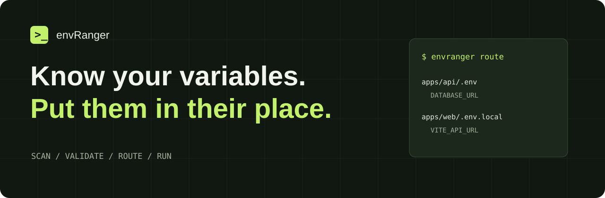

<p align="center"></p>

<p align="center">
  <a href="https://github.com/Breedlove-Jason/envranger/actions/workflows/ci.yml"></a>
  
  <a href="LICENSE"></a>
</p>

<p align="center"><strong>A local-first Node CLI for the environment files your project actually uses.</strong><br>Discover variables. Check your setup. Route each key to the right file.</p>

<p align="center"><a href="https://envranger.jasonbreedlove.dev/">Explore envRanger</a> · <a href="docs/guide.md">User guide</a> · <a href="#quick-start">Quick start</a> · <a href="https://github.com/Breedlove-Jason/envranger/issues">Report an issue</a></p>

---

Your API needs `DATABASE_URL`. Your frontend needs `VITE_API_URL`. Your teammates need a useful `.env.example`. envRanger keeps that configuration understandable without sending your values to a service.

## What it does

| Discover | Manage | Deliver |
| --- | --- | --- |
| Scan real JS/TS syntax for static environment references | Inspect masked keys and file provenance | Route explicit key lists into app-specific files |
| Catch missing, empty and deprecated variables | Preview edits, preserve unrelated entries and back up changed files | Layer development, test or production profiles |
| Generate blank examples and optional TypeScript declarations | Compare and merge files without displaying values | Run a child process with the selected environment |

## Quick start

**Requires Node.js 22+ and npm.** Version 0.3.0 is available from this GitHub repository. It is **not published to the npm registry**; do not install a similarly named registry package expecting this project.

```bash
git clone https://github.com/Breedlove-Jason/envranger.git
cd envranger
npm ci
npm test
npm link

# Now move into the application you want to configure:
cd ../your-app
envranger init --framework node       # preview
envranger init --framework node --write
```

Use `--framework vite` or `--framework next` to start with `.env.local`. Existing files are preserved. Review generated placeholders, fill your local values, and run:

```bash
envranger scan
envranger check
envranger list
envranger example --write
```

For project-local installation, use `npm install --save-dev git+https://github.com/Breedlove-Jason/envranger.git` and `npx envranger`. Pin a reviewed commit for reproducible installs. The Git install builds the CLI with its `prepare` script.

## Put variables where they belong

Declare destinations in `envranger.config.json`. Names below are examples; only you decide which variables are safe for a browser bundle.

```json
{
  "envFile": ".env",
  "scanDirs": ["apps"],
  "required": ["DATABASE_URL", "VITE_API_URL"],
  "profiles": {
    "development": [".env", ".env.local"]
  },
  "routes": {
    "apps/api/.env": ["DATABASE_URL"],
    "apps/web/.env.local": ["VITE_API_URL"]
  }
}
```

```bash
envranger route          # show destination paths and keys; no values, no writes
envranger route --write  # copy keys, retain source, back up changed destinations
```

A missing source key or conflicting destination stops planning before any route writes. `--overwrite` explicitly allows conflicts. Routing is a copy operation: it never deletes your source values. Each file replacement is atomic; a multi-file route is not a transaction. [Routing and recovery →](docs/guide.md#routing-and-recovery)

## Encrypt once. Load only what each app needs.

```bash
envranger encrypt             # preview
envranger encrypt --write     # ciphertext + public key in .env; private key in .env.keys
envranger keys                # inspect public metadata only
envranger check               # automatically decrypt in memory
envranger set API_TOKEN --stdin --write  # stays encrypted
```

The public key remains in the encrypted file. Keep `.env.keys` private; never distribute it with client code. You can encrypt a recipient's file using `encrypt --public-key <their-public-key> --write` without possessing their private key. Existing public keys are preserved, not silently rotated.

Use the [fixed loadEnv.js](examples/loadEnv.js) at your project root with the [example configuration](examples/envranger.config.json). Its backend defaults retain the original required names. Set explicit `access.frontend` and `access.backend` lists for your app.

```js
import loadEnv from './loadEnv.js';
const backend = loadEnv(); // validates the original backend requirements
const frontend = loadEnv({ scope: 'frontend' }); // Node/build-time only
// Requires access.root: true in config AND explicit caller opt-in:
const all = loadEnv({ scope: 'root', allowRoot: true });
```

Scopes are application projections, **not user authentication**. Anyone with the root private key can decrypt the full root file. Give limited recipients separate encrypted files and their own public/private key pairs; use OS permissions, your secret manager, or your deployment platform to authorize people. [Encryption, sharing and loader guide →](docs/guide.md#dotenvx-encryption-and-the-shared-loader)

## Everyday commands

| Task | Command |
| --- | --- |
| Find references with source locations | `envranger scan` |
| Validate configuration (failure exits 1) | `envranger check --profile development` |
| Inspect keys and winning file paths | `envranger list --profile development` |
| Preview a nonsecret edit | `envranger set PORT 3000` |
| Apply it | `envranger set PORT 3000 --write` |
| Inspect one key, redacted | `envranger get DATABASE_URL` |
| Remove a key | `envranger unset OLD_KEY --write` |
| Compare files without values | `envranger diff .env .env.staging` |
| Merge, later source wins | `envranger merge .env.combined .env .env.local --write` |
| Generate a blank example | `envranger example --write` |
| Generate optional Node types | `envranger types --write` |
| Check syntax and duplicate names | `envranger lint` |
| Start a program with a profile | `envranger run --profile development -- node server.js` |
| Write a keys-only health report | `envranger doctor --report` |

Run `envranger <command> --help` for options. Put global `--cwd <directory>` before the command. [Complete guide →](docs/guide.md)

## Deliberate boundaries

- **Local files, no cloud account.** Dotenvx-compatible encryption stays local. No telemetry, uploads, vault service or provider synchronization. Use your hosting provider or secret manager for production secrets.
- **Values stay out of normal output.** `get --reveal` deliberately prints a value; programs started with `run` control their own output. Prefer `set KEY --stdin --write` for secrets so values do not enter command history.
- **Previews first.** Editing commands require `--write`. Existing changed files normally get a private backup in `.envranger/backups/`. Encrypting a file deliberately creates no new plaintext backup. Older backups may contain secrets; keep them ignored and remove them when no longer needed.
- **Literal dotenv syntax.** Comments, `export`, quoted and multiline values are supported. No variable expansion or shell evaluation. Invalid syntax and duplicate keys stop edits. See [parsing limits](docs/guide.md#file-format-and-limits).
- **Static analysis, not whole-program inference.** Scans dot access and literal bracket access on `process.env` and `import.meta.env`. Dynamic names, destructuring, aliases and runtime imports require explicit `required` entries.

## Development

```bash
npm ci
npm test              # build + parser, filesystem and real CLI regression tests
npm pack --dry-run    # inspect the distributable
```

CI exercises Node 22 and 24 on Linux and Windows. The package exposes TypeScript declarations and ESM utilities via `import { scan, loadConfig } from 'envranger'`.

**Upgrading from 0.1?** This is a breaking cleanup: JSON config, previews by default, explicit profiles, corrected precedence and no experimental wizard/vault wrappers. Read the [migration notes](docs/guide.md#migrating-from-01).

Built by [Jason Breedlove](https://www.jasonbreedlove.dev/). [MIT licensed](LICENSE).
